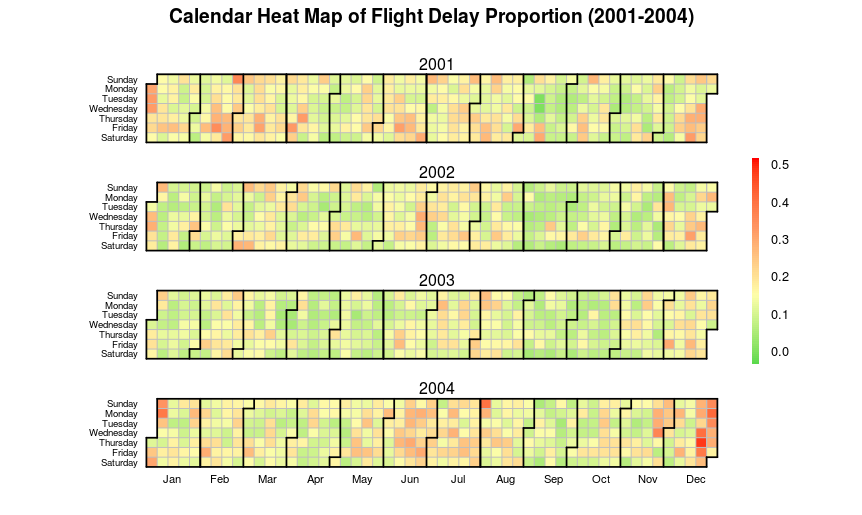
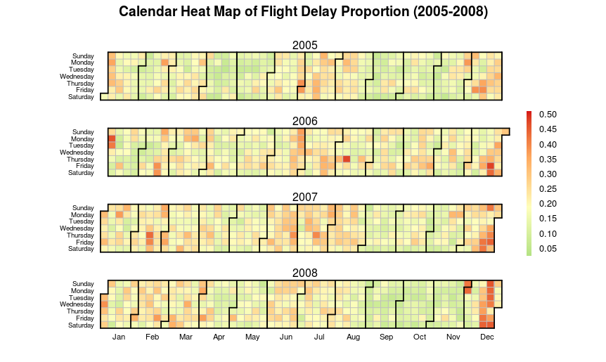

```{r setup, include=FALSE}
knitr::opts_chunk$set(echo = TRUE)
library(dbplyr)
library(data.table)
library(dplyr)
library(readr)
library(bigmemory)
library(biganalytics) 
```

## Introduction

Delayed flights are a common occurance in the airline industry, with 25 million flights being delayed (for at least 15 minutes) for 20 years of data. The issue of delayed flights is seemingly unpredictable with so many factors preceding a successful flight. For the customer then, it is of increased importance to be able to anticipate what may cause a delay in their flight. To try to shed some light on the issue, we analyzed a large dataset from the post 9/11 era (2001-2008), given by the bureau of transportation statistics. The cuases of 

## Methods

Our dataset contains, at its base, 29 variables and 130 million entries of flight data, containing variables such as flight distance, arrival delay, and calendar month. The base dataset is approximately 12 GB in size. 

### Data Cleaning and Pre-processing

We first had to combine yearly weather data to our base dataset, by splitting the dataset into managable chunks (years). The weather datasets included variables such as tempearture, rain (categorical), and wind speed. We combined these separate dateafiles as follows:  

```{r, eval = FALSE}
##read separate files in the dataset folder and conbine their rows 
dataFiles = list.files(pattern = "*.csv") %>% 
  lapply(read.csv, stringsAsFactors=F) %>% 
  bind_rows 
write.csv(dataFiles,file='out.csv')
```

The operation above was performed in the biostatisitics computing cluster using bash scripts, as the operation was too big to perform in R (R would be unable to create a vector of that memory size(??)). 


All in all, our dataset contains 72 varaibles, which we then trimmed. Firstly, we deleted the cancelled and diverted flights that may have different situations with other common delayed flights. Secondly, to make the analysis more efficient, we removed variables meeting the following criteria:   
1. Provides little information on flight delays
2. Provides information contained in other variables
3. Not included in this project objectives
4. Variable has columns with only 'NA'
5. Variables with highly missing data  

Third, we add a covariate named "Season" (i.e. Fall, Spring) based on the "Month" value.  

Snippets of our data cleaning can be shown below:  
```{r, eval = FALSE}
list_file = data.table::fread("out.csv")

dat = filter(list_file, Cancelled==0&Diverted==0)
dat = subset(dat, -c(V1))

dat = select(dat,-c(key2, key, DepTime, `STN---.x`, YEARMODA.x, `STN---.y`, YEARMODA.y,     #reason 1
                    CRSDepTime, ArrTime, CRSArrTime, ActualElapsedTime, CRSElapsedTime, #reason 1
                    Cancelled, CancellationCode, Diverted, #reason 2
                  CarrierDelay, WeatherDelay, NASDelay, SecurityDelay, LateAircraftDelay, STP.x, STP.y, GUST.x, GUST.y)) ##reason 3
#create season covariate
dat = mutate(dat, season = NA)
dat[which(dat$Month==1|dat$Month==2|dat$Month==3),]$season="winter"
dat[which(dat$Month==4|dat$Month==5|dat$Month==6),]$season="spring"
dat[which(dat$Month==7|dat$Month==8|dat$Month==9),]$season="summer"
dat[which(dat$Month==10|dat$Month==10|dat$Month==11),]$season="fall"
```

### Data Importing 

data was loaded in a variety of manners, 
for the parts we could break down by year, either
read.table or read.csv were used.
```{r,eval = FALSE}
#fpath <- file.path(path,"flight_weather_cleaned.csv")
#tic("fread 6gb data import")
#flight_data <- data.table::fread(fpath)
#toc()
```
for the cleaned data, fread 6gb data import: 180.45 sec elapsed, approximately 
3 minutes to import the data fr 32 million observations.

```{r, eval = FALSE}

> #fpath <- file.path(path,"flight_weather_cleaned.csv")
> #tic("fread 6gb data import")
> #flight_data <- data.table::fread(fpath)
> #toc()
> 
> tic( .... [TRUNCATED] 

> x_test <- read.csv("D:/bios625data/flight_weather_cleaned.csv")

> toc()
#test for read.csv: 2654.62 sec elapsed
```
whereas for the read.csv took 40 minutes to import


the bigmemory package (simplified to all number type columns, no need to use ff)  
troubles with loading a 9 GB file on a intel i7-6600U, 2.40 GHz, with 8GB memory, where it would crash Rstudio midway through.

had to resort to cluster commputing for that component

### Analytics

#### Descriptive Statistics

Sneak preview of the data?

```{r, eval = FALSE}
##
#Descriptive Statistics of Variables: (NOT ALL CODE INCLUDED)
select(dat, c(Year, Month, DayofMonth, DayOfWeek, Distance, TaxiIn, TaxiOut, TEMP.x, DEWP.x, SLP.x, VISIB.x,
              WDSP.x, MXSPD.x, MAX.x, MIN.x, PRCP.x, SNDP.x, TEMP.y, DEWP.y, SLP.y, VISIB.y,
              WDSP.y, MXSPD.y, MAX.y, MIN.y, PRCP.y, SNDP.y)) %>% summary()

##obtain frequency tables for categorical covaraites (NOT ALL CATEGORIES INCLUDED)
select(dat, UniqueCarrier) %>% table()
select(dat, FlightNum) %>% table() ## too many categories
select(dat, TailNum) %>% table() ## too many categories
select(dat, Origin) %>% table()
select(dat, Dest) %>% table()
##obtain correlation coefficients of numeric covariates using complete data
select(dat, c(Year, Month, DayofMonth, DayOfWeek, Distance, TaxiIn, TaxiOut, TEMP.x, DEWP.x, SLP.x, VISIB.x,
              WDSP.x, MXSPD.x, MAX.x, MIN.x, PRCP.x, SNDP.x, TEMP.y, DEWP.y, SLP.y, VISIB.y,
              WDSP.y, MXSPD.y, MAX.y, MIN.y, PRCP.y, SNDP.y)) %>% cor(,use = "complete.obs")
```

Results of corelation, not many factors highly correlated w/ each other.


#### Simple Linear regression

Simple Linear Regresion was performed with the bianalytics package. 

```{r, eval = FALSE}
#certain variables were chosen to be categorical via as.factor()
lr_result = biglm.big.matrix (DepDelay ~ Year + Month + DayofMonth + DayOfWeek + Distance + TaxiIn + TaxiOut + TEMP.x +
                                DEWP.x + SLP.x + VISIB.x + WDSP.x + MXSPD.x + PRCP.x + SNDP.x + TEMP.y + DEWP.y +
                                SLP.y + VISIB.y + WDSP.y + MXSPD.y + PRCP.y + SNDP.y + UniqueCarrier + Origin + Dest +
                                Fog.x + Rain.x + Snow.x + Hail.x + Thunder.x + Tornado.x + Fog.y + Rain.y + Snow.y +
                                Hail.y + Thunder.y + Tornado.y + season, data = dat )
```

Write results of regression here, what results are significant and their estimate on delay (i'll look at the xlsx and try to import some of the data into a table) like so:  

Varaible | Estimate | p-value 
-------- | -------- | -------
Temperature | 42342 | 0.234234
Year | adsf | 0.2384
Month | asdf | 0.9234
Thunder | filler | 0.23423423425  

#### Linear Mixed Models

lme4 - Error: cannot allocate vector of size 256.0 Mb on Rstudio
(will expand a bit)

(I added results based on the output you gave, try to expand a bit)

### Visualization

(add what stuff you did here ralph)
tidyverse family


## Results  

put linear regression results here

put lmm results here (if we get them)

put weather results here


\newline


analysis of this figure goes here


\newline


analysis of this figure goes here 


## Conclusion and Further Work

Flight delays may be indicated by the following significant factors: 

Our work was comprehensive, but not exhaustive, with the following topics of interest for future investigation
* Pre 9/11 Era comparison
  + As our analysis contains information on post-9/11, where security measures have been tightened signficantly, we would like to see if effects that are signficant in causing delays in this era are more pronounced before 9/11
* Full dataset (1978-2008) would be too large for our methods used (>20 GB)
  + having computation troubles as seen above, may need different forms
  + Would require different forms of data storage
  + Look into using RHadoop
  + Not limited to cluster computing
* Investigation of different models 
* Dealing with missing data on a large scale
* Cross-validation

## Special Acknowledgements

Special Thanks to Daniel Barker and Rob(??) for their help and availibility in teaching us how to use the computing clusters. 

